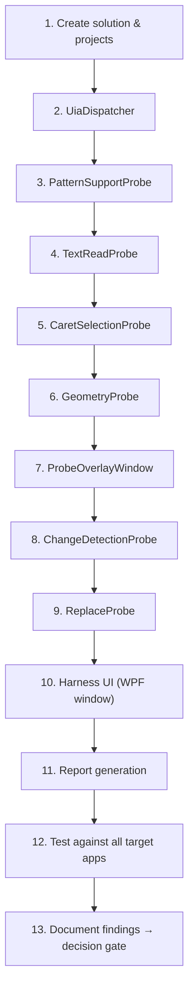
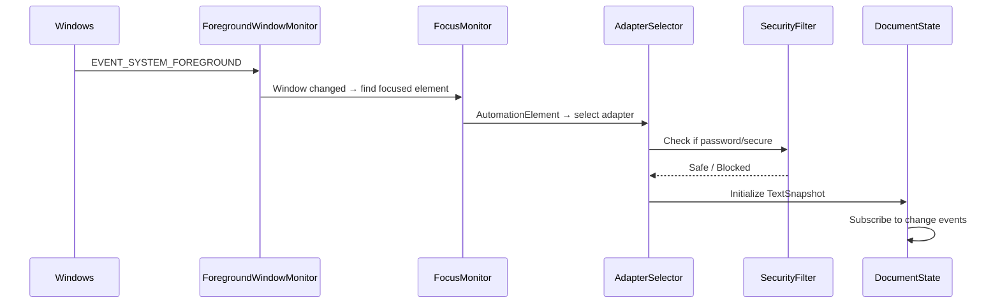
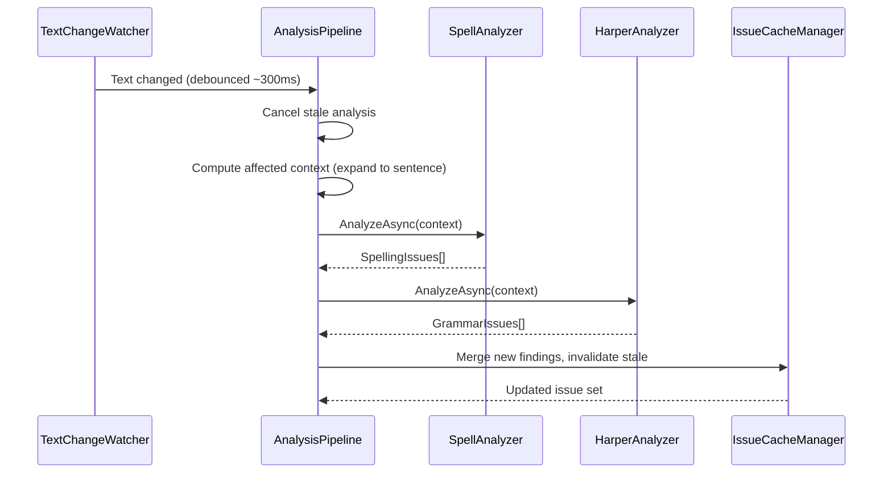
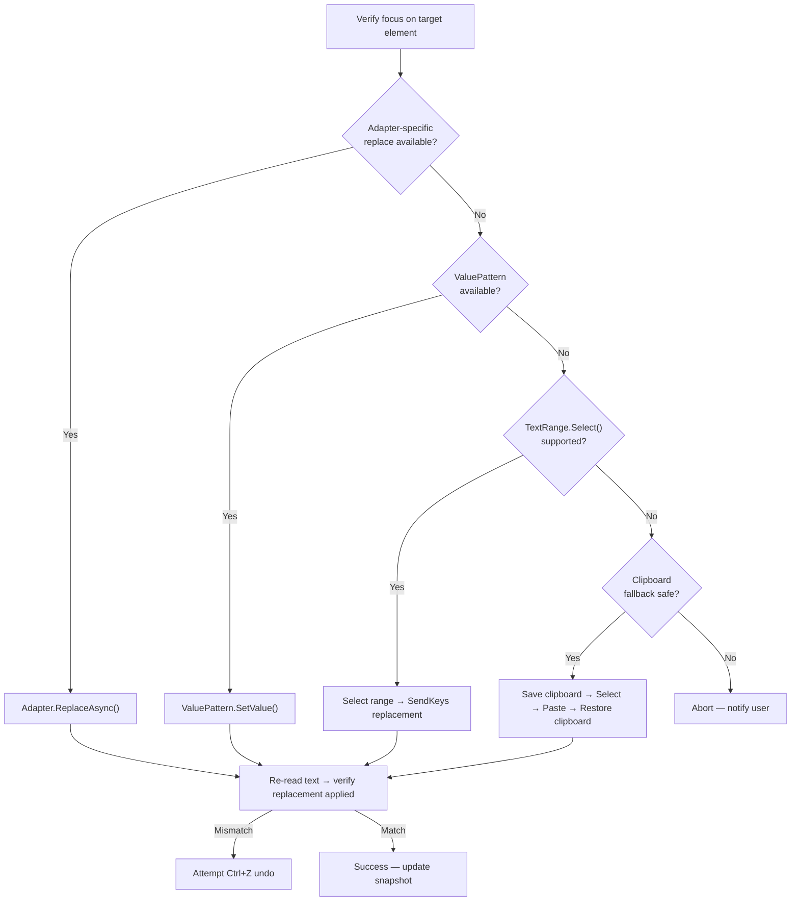

# Redline — Implementation Plan

> **Status:** Draft for review — updated with model guidance
> **Scope:** All phases (0–6), with Phase 0 in full implementation detail

---

## Table of Contents

1. [Model Strategy](#model-strategy--when-to-use-flash-vs-a-stronger-model)
2. [Key Technical Decisions](#key-technical-decisions)
3. [Solution & Repository Structure](#solution--repository-structure)
4. [Phase 0 — Compatibility Harness (Full Detail)](#phase-0--compatibility-harness)
5. [Phase 1 — Core Prototype](#phase-1--core-prototype)
6. [Phase 2 — Corrections](#phase-2--corrections)
7. [Phase 3 — Inline Annotations](#phase-3--inline-annotations)
8. [Phase 4 — Compatibility Hardening](#phase-4--compatibility-hardening)
9. [Phase 5 — Product Hardening](#phase-5--product-hardening)
10. [Phase 6 — Optional AI](#phase-6--optional-ai)
11. [Cross-Cutting Concerns](#cross-cutting-concerns)
12. [Risk Register & Mitigations](#risk-register--mitigations)

---

## Model Strategy — When to Use Flash vs a Stronger Model

Not every task in this plan carries equal reasoning risk. Some are structural boilerplate; others involve subtle Windows interop, threading, or memory safety where a wrong-but-plausible answer causes **silent correctness bugs** (deadlocks, memory corruption, coordinate misalignment, clipboard data loss) rather than obvious crashes.

The effort tables throughout this plan include a **Model** column using this legend:

| Icon | Meaning | When to use |
|------|---------|-------------|
| 🟢 | **Flash-safe** | Boilerplate, models, interfaces, XAML layouts, standard patterns. Flash at any thinking level handles these well. |
| 🟡 | **Flash with careful review** | Moderately complex logic — async patterns, WinRT API calls, event wiring. Flash can generate this but outputs need verification against docs. Use Medium or High thinking. |
| 🔴 | **Stronger model recommended** | COM threading, `unsafe` Rust FFI, P/Invoke with pointer math, multi-concern coordination (overlay + DPI + z-order + hit-testing), or anywhere a subtle bug is silent and dangerous. |

### Why this matters for Redline specifically

Redline's worst failure modes are **not** crashes or compile errors — they are:
- A `UiaDispatcher` that **sometimes** deadlocks under load (wrong apartment threading)
- Bounding rectangles that are **almost** right but off by a DPI scaling factor
- A clipboard restore that **usually** works but silently drops rich content
- A Rust FFI function that **seems fine** but has a use-after-free on the returned `CString`
- An overlay that **appears correct** until the user drags the window to a second monitor

These are exactly the bugs that lighter models produce — code that compiles, runs, and passes basic testing, then fails under real-world conditions. Reserve the stronger model for these high-risk components.

### Cost/speed tradeoff

Roughly **40% of tasks are 🟢**, **25% are 🟡**, and **35% are 🔴**. Using Flash for the green/yellow tasks saves significant time and cost on the structural majority of the codebase, while keeping the stronger model focused on the ~35% where reasoning depth directly prevents production bugs.

---

## Key Technical Decisions

These are binding decisions that shape the entire implementation. Each is documented here so they can be referenced and revisited.

### KD-1: .NET Version & Target Framework

| Decision | Value |
|----------|-------|
| Runtime | .NET 9 (latest LTS-adjacent; .NET 8 LTS is also acceptable) |
| TFM | `net9.0-windows10.0.19041.0` |
| Rationale | Windows-specific TFM unlocks WinRT projections (spelling, notifications) without extra packages. Locks us to Windows, which is acceptable per spec. |

### KD-2: Spelling Engine — Windows Spell Checking API (COM)

| Aspect | Detail |
|--------|--------|
| API | Win32 COM `ISpellCheckerFactory` / `ISpellChecker` (spellcheck.h, Windows 8+). *Revised in Phase 1:* the originally named `Windows.Globalization.SpellChecking` WinRT namespace does not exist. |
| Access | `[ComImport]` interop in `Redline.Analysis/Interop/SpellCheckInterop.cs` — no NuGet package needed |
| Capabilities | `Check(text)` tokenizes and returns errors with offsets + corrective action (suggest / replace / delete repeated word); `Suggest(word)` → suggestions |
| Custom dictionary | Redline's own `personal_dictionary.txt` pre-filters results (the OS user dictionary is left untouched) |
| Limitations | Limited to OS-installed language packs; falls back to en-US, else spelling is disabled |
| Personal dictionary | Words in `personal_dictionary.txt` are treated as correct by `SpellAnalyzer`. "Add to dictionary" appends to this file and updates the in-memory set. |

### KD-3: Grammar Engine — Harper via Custom Rust FFI

| Aspect | Detail |
|--------|--------|
| Approach | Build a thin Rust `cdylib` crate (`harper-ffi`) that wraps `harper-core` and exposes C-compatible functions |
| Binding generation | Use `csbindgen` in `build.rs` to auto-generate C# P/Invoke signatures |
| Output | `harper_ffi.dll` (Windows) shipped alongside Redline.exe |
| Key FFI surface | `harper_lint(text_ptr, text_len) → json_ptr` (returns JSON-serialized lint results), `harper_free(ptr)` (frees Rust-allocated memory) |
| Rationale | Tighter integration than sidecar, avoids IPC overhead, keeps analysis <10ms per Harper's own benchmarks |
| Build integration | Rust build produces the DLL; .NET project copies it to output via a `<None Include="..." CopyToOutputDirectory="PreserveNewest" />` item |

> [!IMPORTANT]
> Since there is no official Harper C FFI, we must build and maintain `harper-ffi` ourselves. This is a small crate (~200 lines) but it couples us to `harper-core`'s Rust API, which may change across versions. Pin the dependency version.

### KD-4: Overlay Rendering — WPF Transparent Windows

| Aspect | Detail |
|--------|--------|
| Technology | WPF `Window` with `AllowsTransparency=True`, `WindowStyle=None`, `Background=Transparent` |
| Click-through | `WS_EX_TRANSPARENT | WS_EX_LAYERED` via `SetWindowLong` P/Invoke |
| DPI | `PerMonitorV2` DPI awareness declared in app manifest |
| Rendering | Direct2D / WPF drawing for squiggle paths; avoids GDI for DPI correctness |
| Topmost | `Topmost=True` with z-order management to stay above target but below popups |

### KD-5: UI Automation Threading

| Aspect | Detail |
|--------|--------|
| UIA thread | Dedicated STA thread for all UIA COM calls (`Thread { ApartmentState = STA }`) |
| Rationale | UIA COM objects are apartment-threaded. Calling from the wrong thread causes deadlocks or marshaling overhead. |
| Pattern | `UiaDispatcher` class wraps a dedicated STA thread with a message pump; all UIA calls go through `UiaDispatcher.InvokeAsync<T>(Func<T>)` |

---

## Solution & Repository Structure

```
Redline/
│
├── Redline.sln
│
├── src/
│   ├── Redline.App/                    # WPF application host (system tray, settings UI)
│   │   ├── Redline.App.csproj          # OutputType=WinExe, uses WPF
│   │   ├── App.xaml / App.xaml.cs
│   │   ├── TrayIcon/
│   │   ├── Settings/
│   │   └── app.manifest                # PerMonitorV2 DPI, UAC
│   │
│   ├── Redline.Core/                   # Domain models, interfaces, no platform dependencies
│   │   ├── Redline.Core.csproj         # net9.0 (not windows-specific)
│   │   ├── Models/
│   │   │   ├── TextSnapshot.cs
│   │   │   ├── TextRange.cs
│   │   │   ├── TextBounds.cs
│   │   │   ├── TextIssue.cs
│   │   │   ├── TextSurfaceContext.cs
│   │   │   ├── TextSurfaceCapabilities.cs
│   │   │   ├── ReplaceResult.cs
│   │   │   └── AiWritingRequest.cs
│   │   ├── Interfaces/
│   │   │   ├── ITextSurfaceAdapter.cs
│   │   │   ├── ITextAnalyzer.cs
│   │   │   ├── IAiWritingProvider.cs
│   │   │   └── IPersonalDictionary.cs
│   │   └── Pipeline/
│   │       ├── AnalysisPipeline.cs
│   │       ├── DocumentState.cs
│   │       └── IssueCacheManager.cs
│   │
│   ├── Redline.Windows/               # Windows integration (UIA, Win32, adapters)
│   │   ├── Redline.Windows.csproj      # net9.0-windows10.0.19041.0
│   │   ├── Automation/
│   │   │   ├── UiaDispatcher.cs
│   │   │   ├── FocusMonitor.cs
│   │   │   ├── ForegroundWindowMonitor.cs
│   │   │   └── TextChangeWatcher.cs
│   │   ├── Adapters/
│   │   │   ├── GenericUiaAdapter.cs
│   │   │   ├── Win32Adapter.cs
│   │   │   ├── ChromiumAdapter.cs
│   │   │   ├── OfficeAdapter.cs
│   │   │   └── ElectronAdapter.cs
│   │   ├── AdapterSelector.cs
│   │   └── SecurityFilter.cs           # Password/secure field detection
│   │
│   ├── Redline.Analysis/              # Analyzer orchestration
│   │   ├── Redline.Analysis.csproj
│   │   ├── SpellAnalyzer.cs            # WinRT ISpellChecker wrapper
│   │   ├── PersonalDictionary.cs
│   │   └── AnalyzerRegistry.cs
│   │
│   ├── Redline.Analysis.Harper/       # Harper FFI integration
│   │   ├── Redline.Analysis.Harper.csproj
│   │   ├── HarperAnalyzer.cs
│   │   ├── HarperInterop.cs            # P/Invoke declarations (auto-generated by csbindgen)
│   │   └── HarperResultMapper.cs
│   │
│   ├── Redline.Annotations/           # Overlay rendering and suggestion UI
│   │   ├── Redline.Annotations.csproj  # WPF library
│   │   ├── OverlayWindow.xaml/.cs
│   │   ├── SquiggleRenderer.cs
│   │   ├── SuggestionPopup.xaml/.cs
│   │   ├── GeometryMapper.cs
│   │   └── OverlayManager.cs
│   │
│   └── Redline.AI/                    # Optional AI providers
│       ├── Redline.AI.csproj
│       ├── OpenAiProvider.cs
│       ├── AzureOpenAiProvider.cs
│       └── LocalModelProvider.cs
│
├── native/
│   └── harper-ffi/                    # Rust cdylib wrapping harper-core
│       ├── Cargo.toml
│       ├── build.rs                   # csbindgen auto-gen
│       └── src/
│           └── lib.rs
│
├── tools/
│   └── Redline.CompatibilityHarness/  # Phase 0 diagnostic tool
│       ├── Redline.CompatibilityHarness.csproj
│       ├── Program.cs
│       ├── Probes/
│       │   ├── TextReadProbe.cs
│       │   ├── GeometryProbe.cs
│       │   ├── ChangeDetectionProbe.cs
│       │   ├── ReplaceProbe.cs
│       │   ├── CaretSelectionProbe.cs
│       │   └── PatternSupportProbe.cs
│       ├── Report/
│       │   ├── CompatibilityReport.cs
│       │   └── ReportRenderer.cs
│       └── Ui/
│           └── ProbeOverlayWindow.xaml/.cs
│
├── tests/
│   ├── Redline.Core.Tests/
│   ├── Redline.Analysis.Tests/
│   ├── Redline.Windows.Tests/
│   └── Redline.Integration.Tests/
│
└── docs/
    ├── architecture.md
    ├── compatibility.md
    ├── privacy.md
    └── decisions/
        ├── KD-001-dotnet-version.md
        ├── KD-002-spelling-engine.md
        ├── KD-003-harper-ffi.md
        ├── KD-004-overlay-rendering.md
        └── KD-005-uia-threading.md
```

---

## Phase 0 — Compatibility Harness

> **Goal:** Prove that `READ → MAP TO SCREEN → DETECT CHANGE → REPLACE` works across representative Windows applications before investing in the production overlay.
>
> **Exit criterion:** Enough high-value applications (Notepad, Chrome/Edge textarea, at least one Office surface) support the necessary capabilities to justify proceeding.

### 0.1 Project Setup

**Create:** `tools/Redline.CompatibilityHarness/Redline.CompatibilityHarness.csproj`

```xml
<Project Sdk="Microsoft.NET.Sdk">
  <PropertyGroup>
    <OutputType>WinExe</OutputType>
    <TargetFramework>net9.0-windows10.0.19041.0</TargetFramework>
    <UseWPF>true</UseWPF>
    <Nullable>enable</Nullable>
    <ImplicitUsings>enable</ImplicitUsings>
  </PropertyGroup>
</Project>
```

> [!NOTE]
> The harness uses WPF so it can render a probe overlay (draw bounding rectangles on screen to visually verify geometry). It is NOT the production overlay — it is a diagnostic visualization.

**Also reference:** `Redline.Core` (for shared models/interfaces) and `Redline.Windows` (for UIA utilities).

However, in Phase 0 we want the harness to be somewhat self-contained — it can define its own lightweight UIA helpers or depend on early `Redline.Windows` code. The preference is to write UIA code directly in the harness first, then extract reusable pieces into `Redline.Windows` once patterns stabilize.

### 0.2 UIA Foundation — `UiaDispatcher`

All UIA calls must happen on a dedicated STA thread. Build this first:

```csharp
// UiaDispatcher.cs — Dedicated STA thread for UI Automation COM calls
public sealed class UiaDispatcher : IDisposable
{
    private readonly Thread _thread;
    private readonly BlockingCollection<Action> _queue = new();
    
    public UiaDispatcher()
    {
        _thread = new Thread(RunLoop) { IsBackground = true };
        _thread.SetApartmentState(ApartmentState.STA);
        _thread.Start();
    }
    
    public Task<T> InvokeAsync<T>(Func<T> func)
    {
        var tcs = new TaskCompletionSource<T>();
        _queue.Add(() =>
        {
            try { tcs.SetResult(func()); }
            catch (Exception ex) { tcs.SetException(ex); }
        });
        return tcs.Task;
    }
    
    public Task InvokeAsync(Action action) =>
        InvokeAsync<object?>(() => { action(); return null; });
    
    private void RunLoop()
    {
        foreach (var action in _queue.GetConsumingEnumerable())
            action();
    }
    
    public void Dispose() { _queue.CompleteAdding(); }
}
```

### 0.3 Core Probes

Each probe tests a single capability axis. All probes target the **currently focused element** (or a user-selected element via point-picking).

#### 0.3.1 `PatternSupportProbe`

**Purpose:** Enumerate what UIA patterns and properties the focused element supports.

**Implementation:**

```
Input: AutomationElement
Output: PatternSupportResult
  - ControlType (Edit, Document, Custom, etc.)
  - ProcessName, WindowTitle
  - SupportsTextPattern: bool
  - SupportsTextPattern2: bool
  - SupportsValuePattern: bool
  - SupportsScrollPattern: bool
  - SupportsTextEditPattern: bool
  - IsPassword: bool
  - IsReadOnly: bool
  - ClassName, FrameworkId, NativeWindowHandle
  - AutomationId
```

Check each pattern via `element.TryGetCurrentPattern(XxxPattern.Pattern, out _)`.

#### 0.3.2 `TextReadProbe`

**Purpose:** Attempt to read text content from the focused element.

**Implementation strategy (in priority order):**

1. **TextPattern** → `DocumentRange.GetText(-1)` — preferred, richest
2. **ValuePattern** → `.Current.Value` — simpler controls
3. **Name property** → `element.Current.Name` — last resort

```
Input: AutomationElement, PatternSupportResult
Output: TextReadResult
  - Method: TextPattern | ValuePattern | NameProperty | Failed
  - Text: string? (first 500 chars for display; full text stored)
  - TextLength: int
  - ReadDurationMs: double
  - Error: string?
```

#### 0.3.3 `CaretSelectionProbe`

**Purpose:** Determine if we can read caret position and selection.

**Implementation:**

- **TextPattern2** → `GetCaretRange()` → zero-length range at caret
- **TextPattern** → `GetSelection()` → selection ranges
- Compute caret offset by comparing the caret range's start against `DocumentRange` start

```
Input: AutomationElement, PatternSupportResult
Output: CaretSelectionResult
  - CanGetCaretRange: bool
  - CaretOffset: int? (if computable)
  - CanGetSelection: bool
  - SelectionText: string?
  - SelectionRangeCount: int
  - Error: string?
```

#### 0.3.4 `GeometryProbe`

**Purpose:** Can we map a character range to screen coordinates?

**Implementation:**

- Get `TextPattern`
- Create a range for a known substring (e.g., characters 10–20)
- Call `range.GetBoundingRectangles()` → `Rect[]`
- Validate: non-empty, reasonable coordinates (within screen bounds), reasonable size

```
Input: AutomationElement, PatternSupportResult, TextReadResult
Output: GeometryResult
  - CanGetBoundingRectangles: bool
  - TestedRange: string (the substring tested)
  - BoundingRects: Rect[]
  - AreRectsReasonable: bool (within screen bounds, positive dimensions)
  - RectComputeDurationMs: double
  - Error: string?
```

The harness should also **visually verify** geometry by drawing red rectangles on a transparent overlay at the reported coordinates. This is critical — the rectangles may be reported but wrong.

#### 0.3.5 `ChangeDetectionProbe`

**Purpose:** Determine if we receive UIA events when text changes.

**Implementation:**

- Subscribe to `TextPattern.TextChangedEvent` on the element
- Subscribe to `TextPattern.TextSelectionChangedEvent`
- Subscribe to `AutomationElement.AutomationPropertyChangedEvent` for `ValuePattern.ValueProperty`
- Prompt the user: "Type something in the target application now"
- Wait up to 10 seconds for events
- Record which events fired, latency, and event args

```
Input: AutomationElement, PatternSupportResult
Output: ChangeDetectionResult
  - ReceivedTextChangedEvent: bool
  - TextChangedEventCount: int
  - TextChangedLatencyMs: double? (time from prompt to first event)
  - ReceivedSelectionChangedEvent: bool
  - ReceivedValueChangedEvent: bool
  - Error: string?
```

> [!WARNING]
> Some applications (notably Chromium-based) may not fire `TextChangedEvent` reliably. This is a known UIA limitation and a key data point for the harness.

#### 0.3.6 `ReplaceProbe`

**Purpose:** Can we safely modify text in the control?

**Implementation (in priority order):**

1. **ValuePattern** → `SetValue(newText)` — replaces entire value
2. **TextPattern range** → Check if `TextRange.AddToSelection` and keyboard simulation can work
3. **Selection + SendKeys** fallback:
   - Select the target range via `TextRange.Select()`
   - `SendKeys` the replacement text
4. **Clipboard fallback:**
   - Select range, copy to verify, paste replacement, restore clipboard

**Safety requirements:**
- Read the current text first
- After replacement, read again and verify the change was applied correctly
- If verification fails, attempt to undo (Ctrl+Z)
- Always prompt the user before modifying text: "This probe will attempt to replace text. Proceed?"

```
Input: AutomationElement, PatternSupportResult, TextReadResult
Output: ReplaceResult
  - Method: ValuePattern | SelectAndType | ClipboardFallback | Failed
  - OriginalText: string
  - ReplacementText: string
  - ResultText: string (what we read back after replacement)
  - VerifiedCorrect: bool
  - DurationMs: double
  - Error: string?
```

### 0.4 Harness UI

A WPF window with:

```
┌─────────────────────────────────────────────────────┐
│  Redline Compatibility Harness                      │
├─────────────────────────────────────────────────────┤
│                                                     │
│  Target: [Pick Focused Element]  [Pick by Point]    │
│                                                     │
│  ── Target Info ──                                  │
│  Process: notepad.exe (PID 12345)                   │
│  Window: Untitled - Notepad                         │
│  Control: Edit (ClassName: Edit)                    │
│  Framework: Win32                                   │
│                                                     │
│  ── Probes ──                                       │
│  [▶ Run All]                                        │
│                                                     │
│  Pattern Support    ✅ Complete                     │
│    TextPattern: ✅  ValuePattern: ✅               │
│    TextPattern2: ❌  ScrollPattern: ✅             │
│                                                     │
│  Text Read          ✅ Success (TextPattern)        │
│    Length: 1,234 chars | 12ms                        │
│    Preview: "The quick brown fox..."                 │
│                                                     │
│  Caret/Selection    ✅ Partial                      │
│    Caret: ✅ offset 45 | Selection: ✅             │
│                                                     │
│  Geometry           ⚠️ Needs Verification           │
│    Bounding rects returned: 1                        │
│    [Show Overlay] to visually verify                 │
│                                                     │
│  Change Detection   ⏳ Waiting for user input...    │
│    Type in the target app now                        │
│                                                     │
│  Replace            ⏸️ Not yet run                  │
│    [▶ Run] (will modify text — prompts first)       │
│                                                     │
│  ── Summary ──                                      │
│  ┌──────────┬──────┬──────────┬────────┬─────────┐  │
│  │ App      │ Read │ Geometry │ Change │ Replace │  │
│  ├──────────┼──────┼──────────┼────────┼─────────┤  │
│  │ Notepad  │  ✅  │    ✅    │   ✅   │   ✅    │  │
│  │ Chrome   │  ✅  │    ⚠️    │   ❌   │   ⚠️    │  │
│  │ ...      │      │          │        │         │  │
│  └──────────┴──────┴──────────┴────────┴─────────┘  │
│                                                     │
│  [Export Report (JSON)]  [Export Report (Markdown)]  │
│                                                     │
└─────────────────────────────────────────────────────┘
```

### 0.5 Probe Overlay Window

A transparent, click-through WPF window used to draw bounding rectangles on screen:

- Fullscreen, topmost, `WS_EX_TRANSPARENT | WS_EX_LAYERED`
- Draws colored rectangles at the coordinates returned by `GeometryProbe`
- Green = reasonable bounds, Red = suspicious (off-screen, zero-size, etc.)
- Auto-hides after 5 seconds or on any key press
- Used for **visual verification only** — the human confirms if the rectangles align with the actual text

### 0.6 Compatibility Report

The harness produces a structured report in JSON:

```json
{
  "timestamp": "2026-10-03T15:30:00Z",
  "machine": { "os": "Windows 11 23H2", "dpi": 150 },
  "results": [
    {
      "application": "Notepad",
      "process": "notepad.exe",
      "controlType": "Edit",
      "frameworkId": "Win32",
      "patterns": {
        "textPattern": true,
        "textPattern2": false,
        "valuePattern": true
      },
      "textRead": { "success": true, "method": "TextPattern", "durationMs": 8 },
      "geometry": { "success": true, "rectsReturned": 1, "visuallyVerified": true },
      "changeDetection": { "textChangedEvent": true, "latencyMs": 45 },
      "replace": { "success": true, "method": "ValuePattern", "verified": true }
    }
  ]
}
```

And a human-readable Markdown version for `docs/compatibility.md`.

### 0.7 Phase 0 Implementation Order



### 0.8 Phase 0 Estimated Effort

| Task | Days | Model |
|------|------|-------|
| Solution scaffolding, project setup | 0.5 | 🟢 Flash |
| `UiaDispatcher` | 0.5 | 🔴 Stronger — STA threading + COM apartment model; wrong code deadlocks silently |
| `PatternSupportProbe` | 0.5 | 🟢 Flash — simple pattern enumeration |
| `TextReadProbe` | 1 | 🟡 Flash (Medium) — UIA pattern fallback logic; verify API signatures |
| `CaretSelectionProbe` | 1 | 🟡 Flash (Medium) — `TextPattern2.GetCaretRange` offset computation |
| `GeometryProbe` + overlay | 2 | 🔴 Stronger — combines UIA cross-process calls, coordinate systems, DPI, and WPF transparent window interop |
| `ChangeDetectionProbe` | 1.5 | 🔴 Stronger — UIA event handler lifetimes; COM prevents correct GC; easy to leak or crash |
| `ReplaceProbe` | 2 | 🔴 Stronger — multi-strategy fallback chain with clipboard save/restore, verification, and undo; data corruption risk |
| Harness UI (WPF XAML + bindings) | 1.5 | 🟢 Flash — standard WPF data binding and layout |
| Report generation (JSON + Markdown) | 0.5 | 🟢 Flash — serialization boilerplate |
| Testing across all 8 target apps | 3 | N/A — manual testing |
| Documentation & decision gate | 1 | 🟢 Flash — prose writing |
| **Total** | **~15** | |

### 0.9 Phase 0 Decision Gate Criteria

After running the harness against all target applications, evaluate:

| Criterion | Pass | Conditional | Fail |
|-----------|------|-------------|------|
| Text reading | ≥6 of 8 targets | 4–5 of 8 | <4 |
| Geometry mapping | ≥4 of 8 targets | 2–3 of 8 | <2 |
| Change detection | ≥4 of 8 targets | 2–3 of 8 | <2 |
| Text replacement | ≥4 of 8 targets | 2–3 of 8 | <2 |

- **All Pass:** Proceed to Phase 1 as designed
- **Any Conditional:** Proceed but revise scope/adapters for that capability
- **Any Fail:** Revisit the interaction model before investing further

---

## Phase 1 — Core Prototype

> **Goal:** A running tray application that monitors focus, reads text via UIA, runs local analysis, and outputs diagnostics.
>
> **Dependencies:** Phase 0 harness data informing adapter design.

### 1.1 Deliverables

| Component | Project | Description |
|-----------|---------|-------------|
| Application host | `Redline.App` | WPF app with system tray icon (NotifyIcon), no main window |
| Domain models | `Redline.Core` | `TextSnapshot`, `TextRange`, `TextIssue`, `TextSurfaceContext`, `TextSurfaceCapabilities`, interfaces |
| Focus monitoring | `Redline.Windows` | `ForegroundWindowMonitor` (Win32 `SetWinEventHook` for `EVENT_SYSTEM_FOREGROUND`), `FocusMonitor` (UIA `FocusChanged` event) |
| Adapter infrastructure | `Redline.Windows` | `ITextSurfaceAdapter`, `AdapterSelector`, `GenericUiaAdapter` |
| Security filter | `Redline.Windows` | `SecurityFilter` — detects password fields, secure controls |
| Text snapshots | `Redline.Core` | `DocumentState` — maintains current/previous snapshots, computes diffs |
| Change detection | `Redline.Windows` | `TextChangeWatcher` — UIA event subscriptions, polling fallback |
| Spelling | `Redline.Analysis` | `SpellAnalyzer` wrapping WinRT `ISpellChecker` with personal dictionary pre-filter |
| Grammar | `Redline.Analysis.Harper` | `HarperAnalyzer` calling `harper_ffi.dll` via P/Invoke |
| Harper FFI | `native/harper-ffi` | Rust `cdylib` exposing `harper_lint`, `harper_free` |
| Analysis pipeline | `Redline.Core` | `AnalysisPipeline` — debounce, cancel stale, run analyzers, normalize results |
| Diagnostic output | `Redline.App` | Log issues to a diagnostics window / output panel (not yet inline annotations) |

### 1.2 Focus Monitoring Flow



### 1.3 Analysis Pipeline Flow



### 1.4 Harper FFI Design

**Rust side (`native/harper-ffi/src/lib.rs`):**

```rust
use harper_core::linting::{LintGroup, Linter, Lint};
use harper_core::parsers::PlainEnglish;
use harper_core::spell::FstDictionary;
use harper_core::{Dialect, Document};
use std::ffi::{CStr, CString};
use std::os::raw::c_char;

/// Lint the given text, returning a JSON string with results.
/// Caller must free the returned pointer with `harper_free`.
#[no_mangle]
pub extern "C" fn harper_lint(
    text_ptr: *const c_char,
    text_len: u32,
) -> *mut c_char {
    // Parse, lint, serialize to JSON, return CString pointer
}

/// Free a string previously returned by harper_lint.
#[no_mangle]
pub extern "C" fn harper_free(ptr: *mut c_char) {
    if !ptr.is_null() {
        unsafe { let _ = CString::from_raw(ptr); }
    }
}
```

**C# side (auto-generated by `csbindgen`, then wrapped):**

```csharp
public class HarperAnalyzer : ITextAnalyzer
{
    public async Task<IReadOnlyList<TextIssue>> AnalyzeAsync(
        TextAnalysisRequest request, CancellationToken ct)
    {
        // Run on thread pool to avoid blocking
        return await Task.Run(() =>
        {
            var resultPtr = HarperInterop.harper_lint(
                request.Text, (uint)request.Text.Length);
            try
            {
                var json = Marshal.PtrToStringUTF8(resultPtr);
                return ParseLintResults(json, request);
            }
            finally
            {
                HarperInterop.harper_free(resultPtr);
            }
        }, ct);
    }
}
```

### 1.5 Spelling Analyzer Design

```csharp
public class SpellAnalyzer : ITextAnalyzer
{
    private readonly ISpellChecker _checker;  // WinRT
    private readonly IPersonalDictionary _personalDict;
    
    public async Task<IReadOnlyList<TextIssue>> AnalyzeAsync(
        TextAnalysisRequest request, CancellationToken ct)
    {
        return await Task.Run(() =>
        {
            var issues = new List<TextIssue>();
            var words = Tokenize(request.Text); // word boundaries
            
            foreach (var (word, offset) in words)
            {
                if (_personalDict.Contains(word)) continue;
                if (_checker.Check(word)) continue;
                
                var suggestions = _checker.Suggest(word)
                    .Take(5).ToList();
                
                issues.Add(new TextIssue
                {
                    StartOffset = request.ContextOffset + offset,
                    Length = word.Length,
                    OriginalText = word,
                    Category = IssueCategory.Spelling,
                    Message = $"Possible misspelling: '{word}'",
                    Suggestions = suggestions,
                    Analyzer = "Spelling",
                });
            }
            return issues;
        }, ct);
    }
}
```

### 1.6 Phase 1 Estimated Effort

| Task | Days | Model |
|------|------|-------|
| Domain models & interfaces (`Redline.Core`) | 2 | 🟢 Flash — records, enums, interfaces; no platform logic |
| System tray app shell (`Redline.App`) | 1.5 | 🟡 Flash (Medium) — WPF + NotifyIcon; verify WPF hosting patterns |
| `ForegroundWindowMonitor` + `FocusMonitor` | 2 | 🔴 Stronger — `SetWinEventHook` P/Invoke with correct callback lifetimes; UIA `FocusChanged` with proper COM prevent prevent prevent prevent prevent prevent prevent prevent prevent prevent prevent prevent prevent prevent prevent prevent prevent prevent prevent prevent prevent prevent prevent prevent prevent prevent prevent prevent prevent prevent prevent prevent prevent prevent prevent prevent prevent prevent prevent prevent prevent prevent prevent prevent prevent prevent prevent prevent prevent prevent prevent prevent prevent prevent prevent prevent prevent prevent prevent prevent prevent prevent prevent prevent prevent prevent prevent prevent prevent prevent prevent prevent prevent prevent prevent prevent prevent prevent prevent prevent prevent prevent prevent prevent prevent prevent prevent prevent prevent prevent prevent prevent prevent prevent prevent prevent prevent prevent prevent prevent prevent prevent prevent prevent prevent prevent prevent prevent prevent prevent prevent prevent prevent prevent prevent prevent prevent prevent prevent prevent prevent prevent prevent prevent prevent prevent prevent prevent prevent prevent prevent prevent prevent prevent prevent prevent prevent prevent prevent prevent prevent prevent prevent prevent prevent prevent prevent prevent prevent prevent prevent prevent prevent prevent prevent prevent prevent prevent prevent prevent prevent prevent prevent prevent prevent prevent prevent prevent prevent prevent prevent prevent prevent prevent prevent prevent prevent prevent prevent prevent prevent prevent prevent prevent prevent prevent prevent prevent prevent prevent prevent prevent prevent prevent prevent prevent prevent prevent prevent prevent prevent prevent prevent prevent prevent prevent preventsubscription prevent prevent prevent prevent |
| `GenericUiaAdapter` | 3 | 🔴 Stronger — full `ITextSurfaceAdapter` against UIA; TextPattern/ValuePattern/TextPattern2 negotiation; geometry |
| `SecurityFilter` | 0.5 | 🟢 Flash — property checks on `AutomationElement` |
| `AdapterSelector` | 1 | 🟡 Flash (Medium) — pattern matching on process/control type |
| `DocumentState` + `TextChangeWatcher` | 2.5 | 🔴 Stronger — snapshot versioning, concurrent access, UIA event subscriptions with proper cleanup |
| Harper FFI Rust crate (`lib.rs` + `build.rs`) | 2 | 🔴 Stronger — `unsafe` Rust, `CString` ownership, `csbindgen` config; memory safety at stake |
| `HarperAnalyzer` C# wrapper | 1.5 | 🟡 Flash (High) — P/Invoke marshaling of returned pointers; verify memory free patterns |
| `SpellAnalyzer` + personal dictionary | 2 | 🟡 Flash (Medium) — WinRT `ISpellChecker` projection; verify method signatures exist |
| `AnalysisPipeline` (debounce, cancel, orchestrate) | 2 | 🔴 Stronger — `CancellationTokenSource` chaining, race condition avoidance |
| Diagnostic output UI | 1 | 🟢 Flash — WPF data-bound list view |
| Integration testing | 2 | 🟡 Flash (Medium) — test scaffolding is routine but UIA assertions need care |
| **Total** | **~23** | |

---

## Phase 2 — Corrections

> **Goal:** Users can see issues, view suggestions, and apply corrections safely.

### 2.1 Deliverables

| Component | Description |
|-----------|-------------|
| Common issue model | Full `TextIssue` with ID, snapshot version, confidence, category enum |
| Issue cache | Thread-safe `IssueCacheManager` — keyed by `SurfaceId`, invalidates on text change, preserves unaffected issues |
| Suggestion UI | Lightweight popup showing issue details + suggestion list (not yet inline — activated from diagnostic panel or keyboard shortcut) |
| Safe replacement | `ReplacementEngine` implementing the priority chain: ValuePattern → adapter-specific → select+type → clipboard fallback |
| Source verification | Pre-replacement check: re-read the target range, verify it still matches expected text, abort if mismatch |
| Stale-state protection | Snapshot versioning; corrections carry their originating version; reject if current version differs |
| Personal dictionary | "Add to dictionary" action, "Ignore once" (session-scoped), "Ignore rule" (persisted) |

### 2.2 Replacement Engine Priority Chain

> **Revised during implementation:** the shipped order is *select range + type* → *select range + guarded paste* → *ValuePattern.SetValue* (only for controls with no TextPattern). `SetValue` rewrites the whole document — losing undo history and formatting and risking concurrent edits — and Phase 0 showed it silently fails in CKEditor, while select+type preserved undo/formatting in every tested app (Notepad, Word, Teams, Outlook). The paste fallback only runs when the clipboard is empty or plain text, so it can be restored exactly. The chart below is the original design.



### 2.3 Phase 2 Estimated Effort

| Task | Days | Model |
|------|------|-------|
| Issue cache manager | 2 | 🔴 Stronger — thread-safe collection with version-gated invalidation; concurrent read/write correctness |
| Replacement engine + fallback chain | 4 | 🔴 Stronger — highest data-corruption risk in the project; clipboard save/restore, focus verification, multi-strategy fallback with undo |
| Source verification logic | 1.5 | 🔴 Stronger — TOCTOU race between verify and write; must reason about acceptable risk window |
| Suggestion popup (temporary UI) | 2 | 🟢 Flash — WPF popup with data binding |
| Personal dictionary persistence | 1 | 🟢 Flash — file I/O + `HashSet<string>` |
| Ignore once / ignore rule | 1 | 🟢 Flash — session set + persisted set logic |
| Stale-state protection | 1.5 | 🟡 Flash (High) — version comparison is simple; but integration with cache invalidation needs care |
| Testing across target apps | 3 | N/A — manual + scripted testing |
| **Total** | **~16** | |

---

## Phase 3 — Inline Annotations

> **Goal:** Squiggle underlines appear beneath flagged text in the target application, and clicking a squiggle opens the suggestion popup.

### 3.1 Deliverables

| Component | Description |
|-----------|-------------|
| `GeometryMapper` | Maps `TextIssue.StartOffset + Length` → screen `Rect[]` using `TextPattern.GetBoundingRectangles()` |
| `OverlayWindow` | Per-monitor transparent WPF window, click-through except for squiggle hit regions |
| `SquiggleRenderer` | Draws wavy underlines at mapped coordinates; color-coded by category (red=spelling, blue=grammar, yellow=style) |
| `OverlayManager` | Creates/destroys/repositions overlays; subscribes to window move/resize/scroll events; manages visibility |
| `SuggestionPopup` | Positioned near the squiggle; shows issue detail + suggestions; activated by clicking squiggle area or keyboard shortcut |
| Scroll synchronization | Re-query geometry on scroll events; cull off-screen issues; debounce re-renders |
| Multi-monitor / DPI | Detect monitor changes via `WM_DISPLAYCHANGE` / `WM_DPICHANGED`; recalculate geometry per-monitor |

### 3.2 Overlay Architecture

```
┌─────────────────────────────────────┐
│  Target Application Window          │
│                                     │
│  "This sentence have an error."     │
│                                     │
└─────────────────────────────────────┘
         ↕ (z-order: overlay above target)
┌─────────────────────────────────────┐
│  Overlay Window (transparent)       │
│                                     │
│                ~~~~                 │  ← squiggle drawn at mapped coords
│                                     │
└─────────────────────────────────────┘
         ↕ (z-order: popup above overlay)
┌──────────────────┐
│  Suggestion Popup │  ← positioned near squiggle
│  "have" → "has"  │
│  ✓ has           │
│  Ignore          │
└──────────────────┘
```

> **As built:** one overlay per *focused text field* (sized to its visible rectangle, which clips scrolled-out text for free) rather than one per monitor. It is click-through and non-activating, and sits directly above the target window in the normal z-order instead of topmost, so anything covering the target — other apps, the target's own menus — covers the squiggles too. It is deliberately *not* an owned window of the target: cross-process ownership attaches input queues, so a hung target could hang Redline. Squiggles render in physical pixels (geometry straight from UIA) with a per-monitor DPI transform. Geometry is verified per issue (the range must read as the flagged text) and skipped when it doesn't. Window move/resize uses a per-process WinEvent hook; scrolling is caught by a 400 ms refresh. Activation is Option B (hotkey, default Ctrl+Alt+.).

**Key challenge:** The overlay must track the target window's position frame-by-frame without flicker. Strategies:

1. **WinEventHook** for `EVENT_OBJECT_LOCATIONCHANGE` on target window → reposition overlay
2. **Periodic geometry refresh** (every 500ms) as a safety net
3. **Aggressive invalidation**: hide squiggles when uncertain, re-query when stable

### 3.3 Squiggle Click Detection

The overlay is `WS_EX_TRANSPARENT` (click-through) **except** for small hit-test regions around squiggles. Two approaches:

- **Option A:** Override `WndProc` / `HitTest` — return `HTTRANSPARENT` everywhere except squiggle bounding boxes. This lets clicks pass through to the target app for normal interaction, but activates the suggestion popup when clicking directly on a squiggle.
- **Option B:** Keep fully click-through; use a global hotkey (e.g., `Ctrl+.`) when the caret is on a squiggled range to activate the popup.

> [!TIP]
> Option B is simpler and avoids the complexity of selective hit-testing. Start with B; add A later if user feedback demands it.

### 3.4 Phase 3 Estimated Effort

| Task | Days | Model |
|------|------|-------|
| `GeometryMapper` | 3 | 🔴 Stronger — coordinate transform from UIA screen coords to overlay local coords; DPI-sensitive math |
| `OverlayWindow` (transparent, DPI-aware) | 3 | 🔴 Stronger — `WS_EX_TRANSPARENT`, `WS_EX_LAYERED`, `SetWindowLong` P/Invoke, `PerMonitorV2`; wrong values = invisible/broken window |
| `SquiggleRenderer` | 2 | 🟡 Flash (Medium) — WPF geometry/path drawing; rendering is standard but coordinates come from GeometryMapper |
| `OverlayManager` (lifecycle, positioning) | 3 | 🔴 Stronger — hardest integration problem; coordinates window tracking, event subscriptions, overlay lifecycle, visibility across focus changes |
| Scroll / resize synchronization | 3 | 🔴 Stronger — `WinEventHook` for `EVENT_OBJECT_LOCATIONCHANGE`, debounced geometry re-query, aggressive invalidation |
| `SuggestionPopup` (positioned, focus-aware) | 2.5 | 🟡 Flash (High) — WPF popup positioning is standard but `ShowActivated=False` + `WS_EX_NOACTIVATE` needs P/Invoke |
| Multi-monitor / DPI handling | 2 | 🔴 Stronger — per-monitor DPI detection, `WM_DPICHANGED`, coordinate recalculation across monitor boundaries |
| Click / hotkey activation | 1.5 | 🟡 Flash (Medium) — global hotkey registration via `RegisterHotKey` P/Invoke |
| Visual polish & edge cases | 2 | 🟡 Flash (Medium) — iterative refinement |
| Testing across target apps | 3 | N/A — manual testing |
| **Total** | **~25** | |

---

## Phase 4 — Compatibility Hardening

> **Goal:** Specialized adapters for applications where the generic UIA adapter falls short, based on Phase 0/3 test data.

### 4.1 Approach

Only build specialized adapters where **evidence** from harness testing proves the generic adapter is insufficient.

| Adapter | Trigger to build | Likely specializations |
|---------|----------------|-----------------------|
| `ChromiumAdapter` | Chrome/Edge textarea geometry is inaccurate or events don't fire | Chrome DevTools Protocol (CDP) for text reading; accessibility tree navigation for contenteditable |
| `OfficeAdapter` | Word/Outlook UIA is insufficient | Office COM Interop (`Microsoft.Office.Interop.Word`) for rich text access and replacement |
| `ElectronAdapter` | VS Code or Teams UIA patterns differ | Electron-specific accessibility tree patterns; `monaco-editor` API via extension |
| `Win32Adapter` | Legacy Win32 controls lack TextPattern | `EM_GETLINE`, `EM_REPLACESEL` Win32 messages for classic Edit/RichEdit controls |

### 4.2 Decision Framework

For each failing target application:

1. **Diagnose** using the compatibility harness — what specific capability fails?
2. **Research** alternative APIs for that application class
3. **Prototype** the fix in the harness — does it resolve the issue?
4. **Extract** into a dedicated adapter only if the fix works and the generic adapter cannot be extended
5. **Register** the adapter with `AdapterSelector` using `CanHandle()` priority

### 4.3 Phase 4 Estimated Effort

| Task | Days | Model |
|------|------|-------|
| `ChromiumAdapter` (if needed) | 5–8 | 🔴 Stronger — Chrome DevTools Protocol integration, accessibility tree navigation for contenteditable |
| `OfficeAdapter` (if needed) | 5–8 | 🔴 Stronger — Office COM Interop, apartment threading with Office's own COM model |
| `Win32Adapter` (if needed) | 5–8 | 🔴 Stronger — `SendMessage` with `EM_GETLINE`/`EM_REPLACESEL`, Win32 control internals |
| `ElectronAdapter` (if needed) | 5–8 | 🟡 Flash (High) — likely UIA variations rather than new APIs; depends on findings |
| Compatibility matrix documentation | 2 | 🟢 Flash — prose + tables |
| Regression testing | 3 | N/A — manual + scripted |
| **Total** | **~20–30** (highly variable) | |

---

## Phase 5 — Product Hardening

> **Goal:** Redline is a polished, installable, stable Windows utility.

### 5.1 Deliverables

| Area | Components |
|------|-----------|
| **Settings UI** | WPF settings window: General (startup, language, delay), Writing (spelling on/off, grammar on/off, style suggestions), Applications (exclusion list, compatibility status) |
| **Startup** | Registry key `HKCU\Software\Microsoft\Windows\CurrentVersion\Run` or Task Scheduler for "Start with Windows" |
| **Application exclusions** | User-configurable list of processes to never analyze; persisted in `settings.json` |
| **Installer** | MSIX or WiX-based MSI; includes .NET runtime if needed; installs `harper_ffi.dll` alongside |
| **Auto-update** | Simple version check against a hosted JSON manifest; download + replace on next restart |
| **Crash handling** | Global exception handler → log to `%LOCALAPPDATA%\Redline\logs\crash.log`; no user text in crash logs |
| **Performance instrumentation** | `Stopwatch`-based timing on hot paths; periodic stats logging (issues/sec, overlay redraws/sec, memory) |
| **Diagnostics mode** | Opt-in verbose logging toggle in settings; captures adapter decisions, UIA patterns, timing — still no user text |
| **Settings persistence** | `%LOCALAPPDATA%\Redline\settings.json` — JSON with schema validation |
| **Personal dictionary** | `%LOCALAPPDATA%\Redline\personal_dictionary.txt` — one word per line |

### 5.2 Phase 5 Estimated Effort

| Task | Days | Model |
|------|------|-------|
| Settings UI | 4 | 🟢 Flash — standard WPF MVVM window with tabs and data binding |
| Startup registration | 0.5 | 🟢 Flash — registry key write via `Microsoft.Win32.Registry` |
| Application exclusions | 1.5 | 🟢 Flash — list management + settings persistence |
| Installer (MSIX or WiX) | 3 | 🟡 Flash (High) — WiX XML authoring; verify against current WiX schema |
| Auto-update mechanism | 2 | 🟡 Flash (Medium) — HTTP version check + file download; verify secure patterns |
| Crash handling + structured logging | 2 | 🟡 Flash (Medium) — `AppDomain.UnhandledException` + Serilog; ensure no user text leaks |
| Performance instrumentation | 1.5 | 🟢 Flash — `Stopwatch` wrapping, periodic `EventSource` counters |
| Diagnostics mode | 1 | 🟢 Flash — log level toggle |
| End-to-end testing | 3 | N/A — manual + scripted |
| **Total** | **~19** | |

---

## Phase 6 — Optional AI

> **Goal:** User-initiated AI rewriting via local or remote LLM providers.

### 6.0 On-device AI grammar (added; done)

Before the rewriting work below, Phase 6 gained an opt-in **AI grammar check**: GRMR-V3-G1B (Gemma 3 1B
fine-tuned for grammar correction, Q4_K_M GGUF, downloaded on request and SHA-256 verified) runs in-process
via LLamaSharp/llama.cpp on the CPU. It is a supplementary `ITextAnalyzer`: sentences are corrected in the
background and cached, the model's rewrite is diffed into word-level issues (rewrites are rejected), and
`AnalysisPipeline.Refresh()` re-publishes when results arrive. Nothing leaves the machine, so it needs none of
the privacy controls below. Details in CLAUDE.md ("Phase 6 — AI grammar").

### 6.1 Deliverables

| Component | Description |
|-----------|-------------|
| `IAiWritingProvider` | Interface: `RewriteAsync(AiWritingRequest) → AiWritingResult` |
| Provider implementations | `OpenAiProvider`, `AzureOpenAiProvider`, `LocalModelProvider` (e.g., llama.cpp via HTTP) |
| Rewrite UI | Context menu or shortcut on selected text → "Rewrite as…" submenu: Concise, Professional, Friendly, Clear, Custom prompt |
| Privacy controls | Settings: enable/disable AI, choose provider, privacy warning for remote providers, "what will be sent" preview |
| Text scoping | Only send the selected text + minimal surrounding context (1 sentence before/after) |
| Result handling | Show diff of original vs. rewritten; user confirms before applying |

### 6.2 Phase 6 Estimated Effort

| Task | Days | Model |
|------|------|-------|
| `IAiWritingProvider` + abstraction | 1 | 🟢 Flash — interface + request/response models |
| `OpenAiProvider` / `AzureOpenAiProvider` | 2 | 🟢 Flash — HTTP client + JSON against well-documented APIs |
| `LocalModelProvider` (HTTP to local server) | 2 | 🟡 Flash (Medium) — local model API varies; verify endpoint compatibility |
| Rewrite UI (context menu + diff view) | 3 | 🟡 Flash (Medium) — WPF diff rendering; inline text comparison |
| Privacy controls & settings | 1.5 | 🟢 Flash — settings toggles + warning dialogs |
| Testing | 2 | 🟢 Flash — mock provider unit tests |
| **Total** | **~12** | |

---

## Cross-Cutting Concerns

### Logging

```csharp
// Structured logging via Microsoft.Extensions.Logging + Serilog file sink
// Categories: Redline.Windows, Redline.Analysis, Redline.Annotations, etc.
// NEVER log: user text, clipboard contents, document content
// DO log: process name, adapter selected, capabilities, timing, issue counts
```

**Log location:** `%LOCALAPPDATA%\Redline\logs\redline-{date}.log`
**Retention:** 7 days, max 50MB total

### Configuration

```json
// %LOCALAPPDATA%\Redline\settings.json
{
  "general": {
    "startWithWindows": true,
    "enabled": true,
    "language": "en-US",
    "analysisDelayMs": 300
  },
  "writing": {
    "spelling": true,
    "grammar": true,
    "styleSuggestions": false
  },
  "applications": {
    "excluded": ["KeePass.exe", "1Password.exe"]
  },
  "ai": {
    "enabled": false,
    "provider": null,
    "endpoint": null
  }
}
```

### Dependency Injection

Use `Microsoft.Extensions.DependencyInjection` throughout:

```csharp
services.AddSingleton<UiaDispatcher>();
services.AddSingleton<ForegroundWindowMonitor>();
services.AddSingleton<FocusMonitor>();
services.AddSingleton<AdapterSelector>();
services.AddSingleton<SecurityFilter>();
services.AddSingleton<DocumentState>();
services.AddSingleton<AnalysisPipeline>();
services.AddSingleton<IssueCacheManager>();
services.AddSingleton<OverlayManager>();
services.AddTransient<ITextAnalyzer, SpellAnalyzer>();
services.AddTransient<ITextAnalyzer, HarperAnalyzer>();
services.AddSingleton<IPersonalDictionary, PersonalDictionary>();
```

### Testing Strategy

| Layer | Approach |
|-------|----------|
| `Redline.Core` | Pure unit tests — no Windows dependencies |
| `Redline.Analysis` | Unit tests with mock dictionaries; integration tests with real WinRT spell checker |
| `Redline.Analysis.Harper` | Integration tests calling real `harper_ffi.dll` |
| `Redline.Windows` | Integration tests requiring a running target app (Notepad); run in CI with a scheduled window |
| `Redline.Annotations` | Manual testing + screenshot comparison; automated smoke tests launching overlay and verifying render |
| End-to-end | Scripted scenarios: launch Notepad → type text → verify issues detected → apply correction → verify text changed |

---

## Risk Register & Mitigations

| # | Risk | Likelihood | Impact | Mitigation | Phase |
|---|------|-----------|--------|------------|-------|
| R1 | Text geometry mapping fails for Chromium | High | High | Harness validates first; CDP fallback; degrade to no-overlay mode | 0, 4 |
| R2 | Harper API breaks across versions | Medium | Medium | Pin `harper-core` version; thin FFI surface; `ITextAnalyzer` abstraction allows swapping | 1 |
| R3 | Overlay flickers during scroll/resize | High | Medium | Event-driven repositioning; hide-when-uncertain; debounced re-render | 3 |
| R4 | UIA event storms during rapid typing | Medium | Medium | Debounce (300ms); cancel stale analysis; coalesce events | 1 |
| R5 | Replacement corrupts clipboard | Medium | High | Save/restore clipboard; verify before/after; Ctrl+Z fallback | 2 |
| R6 | Secure field accidentally analyzed | Low | Critical | `SecurityFilter` checks `IsPassword`, control type, process exclusion list | 1 |
| R7 | WinRT SpellChecker lacks language pack | Low | Medium | Check at startup; warn user; degrade to grammar-only | 1 |
| R8 | DPI scaling misaligns overlays | Medium | Medium | `PerMonitorV2` manifest; per-monitor geometry recalculation | 3 |
| R9 | Focus stealing by suggestion popup | Medium | Medium | `ShowActivated=False`; `WS_EX_NOACTIVATE`; return focus immediately | 2, 3 |

---

## Overall Timeline Summary

| Phase | Description | Est. Days | 🟢 Flash | 🟡 Flash+Review | 🔴 Stronger | Cumulative |
|-------|-------------|-----------|----------|-----------------|-------------|------------|
| 0 | Compatibility Harness | 15 | 3.5 days | 2 days | 6.5 days | 15 |
| 1 | Core Prototype | 23 | 4 days | 5.5 days | 11.5 days | 38 |
| 2 | Corrections | 16 | 4 days | 1.5 days | 7.5 days | 54 |
| 3 | Inline Annotations | 25 | 0 days | 8 days | 14 days | 79 |
| 4 | Compatibility Hardening | 20–30 | 2 days | 5–8 days | 10–17 days | 99–109 |
| 5 | Product Hardening | 19 | 9 days | 7 days | 0 days | 118–128 |
| 6 | Optional AI | 12 | 6.5 days | 3.5 days | 0 days | 130–140 |
| | **Totals** | **130–140** | **~29 days (21%)** | **~33 days (24%)** | **~50–56 days (39%)** | |

> [!IMPORTANT]
> **Phase 3 (Inline Annotations) and Phase 4 (Compatibility Hardening) are almost entirely 🔴 stronger-model territory.** These phases deal with the hardest problems in the project — coordinate math, overlay synchronization, and application-specific COM/API interop. In contrast, **Phase 5 and Phase 6 are nearly all 🟢/🟡** and can be built almost entirely with Flash.

> [!NOTE]
> These are single-developer estimates. Actual timelines will depend on the Phase 0 findings, the number of specialized adapters needed (Phase 4), and the depth of edge cases encountered in overlay synchronization (Phase 3). The ~16% unaccounted-for time is manual testing (N/A rows).

---

## Next Step

*Updated 2026-10-04.* Phases 0–5 are complete (see CLAUDE.md for commits and details); Phase 6 has the
on-device AI grammar check (6.0). The 6.1 AI rewriting deliverables are **on hold** by the owner's choice.
Gaps found in a review of this plan and closed since: overlay z-order for topmost targets, overlay
position after a DPI change, perf rates and memory (5.1), per-app compatibility status (5.1, as a local
compatibility record — see `docs/telemetry.md` for the optional, not-yet-built sharing step), overlay
smoke tests and CI (Testing Strategy). Still open: verifying multi-monitor / non-100% DPI on real
hardware (R8).
