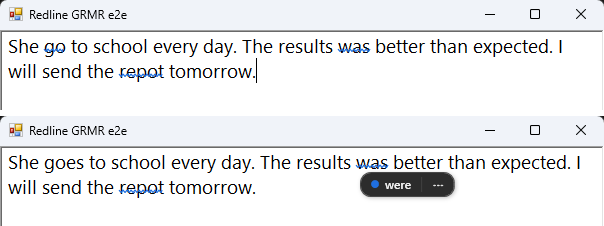
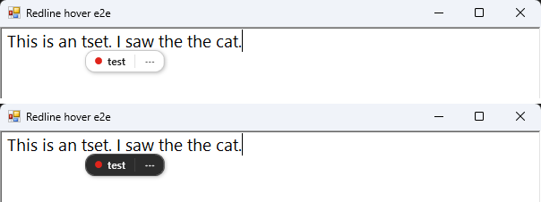
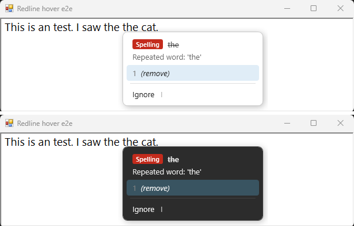
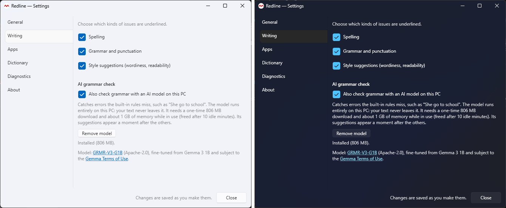

# Redline

Spelling and grammar checking for all of Windows. Redline follows the text box you're typing in —
Notepad, Word, Teams, Outlook on the web, chat apps — underlines mistakes in place, and fixes them
with a click or a hotkey.

Everything runs locally: spelling uses the Windows spell checker, grammar uses
[Harper](https://github.com/Automattic/harper), and an optional AI grammar model runs on your own CPU.
No text leaves your machine, and Redline's logs never contain what you type. The only network requests
Redline makes are a daily check of this repository's releases for updates (Settings › About; it can be
turned off) and, if you turn on AI grammar, a one-time download of the model.

> **Status:** pre-release (0.x). It works day to day on the apps listed in
> [docs/compatibility.md](docs/compatibility.md); expect rough edges elsewhere.



## Features

- Squiggles drawn right over the app you're typing in: red for spelling, blue for grammar, purple for
  punctuation (style suggestions, in amber, are optional)
- Point at a squiggle for a one-click fix, or press **Ctrl+Alt+.** for all suggestions
- Optional AI grammar check with an on-device model that catches errors the rules miss (below)
- Follows the Windows light/dark app mode
- Add to dictionary, ignore once, or ignore a grammar rule everywhere
- Skips password fields, password managers and terminals automatically; exclude any other app in Settings
- Every fix is verified before and after typing, and undone if the result isn't what was expected

| Quick fix (light / dark) | All suggestions (light / dark) |
|---|---|
|  |  |

## AI grammar check (optional)

Harper's rules are fast and precise but miss errors like *"She go to school"* or *"The results was
better then expected."* Turn on **Settings › Writing › Also check grammar with an AI model on this PC**
and Redline also runs [GRMR-V3-G1B](https://huggingface.co/qingy2024/GRMR-V3-G1B), a 1-billion-parameter
model (Gemma 3 1B fine-tuned for grammar correction), through [llama.cpp](https://github.com/ggml-org/llama.cpp)
on your CPU.

- **Private:** the model runs on your PC; your text is never sent anywhere.
- **One-time download:** 806 MB (Q4_K_M) from Hugging Face, pinned to a specific revision and checked
  against its SHA-256 before use. Stored in `%LOCALAPPDATA%\Redline\models`; *Remove model* deletes it.
- **Resources:** about 1 GB of memory while in use, freed after 10 idle minutes. Each sentence takes
  roughly half a second on a typical laptop CPU, so the model's suggestions appear a moment after the
  others, only for sentences you've changed, and are cached.
- **Conservative:** it only adds underlines where spelling and Harper have none, and drops any answer
  that rewrites a sentence instead of correcting it.



## Install

Download `Redline-<version>-x64.msi` from [Releases](../../releases) and run it. It installs for the
current user only (no admin rights needed), starts Redline, and sets it to start when you sign in.
Redline lives in the system tray; right-click the icon for Settings, Pause and Exit.

The installer isn't code-signed yet, so Windows SmartScreen may warn about it
(**More info → Run anyway**).

Requires Windows 10 (version 2004) or Windows 11, x64.

Redline checks for new releases once a day. When one is out, it downloads the installer in the
background, verifies its SHA-256 checksum, and offers it from the tray; it installs only when you click.

## Build from source

Requires the .NET 9 SDK, and the Rust toolchain (MSVC) for the Harper grammar library.

```powershell
cd native/harper-ffi; cargo build --release; cd ../..
dotnet build Redline.sln
dotnet test Redline.sln
dotnet run --project src/Redline.App
```

Build the installer with `powershell -ExecutionPolicy Bypass -File installer/build.ps1` (output in `artifacts/`;
needs `cargo install cargo-about --locked --features cli` for the license notices). Publish a release with
`installer/release.ps1` after bumping `<Version>` in `Directory.Build.props`.

[IMPLEMENTATION_PLAN.md](IMPLEMENTATION_PLAN.md) describes the architecture; [CLAUDE.md](CLAUDE.md) holds
the current status and working notes.

## License

MIT — see [LICENSE](LICENSE). Redline bundles [Harper](https://github.com/Automattic/harper)
(Apache-2.0) and its Rust dependencies, [LLamaSharp](https://github.com/SciSharp/LLamaSharp) and
[llama.cpp](https://github.com/ggml-org/llama.cpp) (MIT), and the .NET runtime under their own licenses;
the installer includes `THIRD-PARTY-NOTICES.txt` with all of them (also attached to each release, and
under Settings › About). The optional GRMR-V3-G1B model is not bundled; it is Apache-2.0 and, as a
fine-tune of Gemma 3, also subject to the [Gemma Terms of Use](https://ai.google.dev/gemma/terms).
